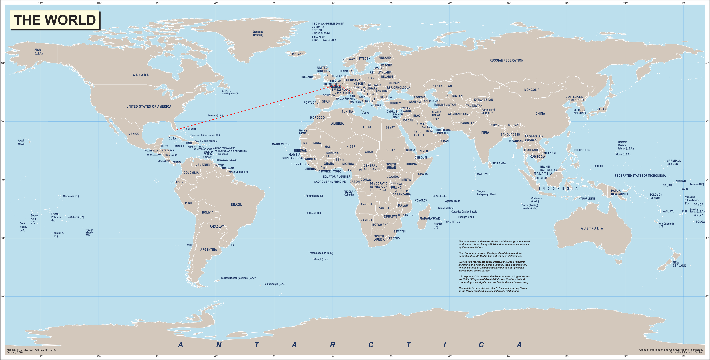

# Plane Route Calculator Project


By: Fang Yi Lin, Jerry Wang, Yuqi Wen, Dmytro Shmidt

In this project, we set out to answer the question: for a specific plane with a restricted maximum range, what is the best (shortest) route the plane can take? Our project allows individual pilots flying smaller planes to efficiently calculate the shortest route they can take to their destination. Our project also more broadly allows pilots or airlines to calculate and visualize the shortest route available for any kind of plane and any route they may want to fly. We answered this question using Dijkstra’s algorithm and Xiaolin Wu’s line tracing algorithm. We also used BFS to ensure that our graphs were correct and that paths either existed or did not exist between edges.


# How to run the program

```

make

./main

```

The user is then prompted to choose the datasets to use. You will need to input the paths to three datasets: airports, routes, and planes. If you want to default to the standard Openflights datasets, press enter each time you are prompted.

The program will output the airports and planes from the datasets you have chosen to airports.txt and planes.txt respectively in the same folder as main.cpp. You will be prompted to enter the names of your start airport, destination airport and plane in that order. Please make sure to include the “” when you are inputting the model of your plane.

The shortest route for the given plane you should take is written to the terminal under the line: “here is the route you should take”.

The route will also be drawn on a flat world map. You may view this at route.png in the same folder as main.cpp.

Example PNG image file that was produced for the shortest route from Miami International Airport to Milano Linate Airport on a Boeing 737:



To terminate the program at any point, please use `Ctrl-C`.


# How to run the tests

```

make test


./test

```

Our tests test the functionality of:


1. Parsers and Parsing all datasets (smaller custom datasets with invalid or malformed entries were included)
2. Constructing the Airport, Plane, and RouteMaker classes
3. Setters and getters for the abovementioned classes
4. Constructing a graph
5. Dijkstra’s algorithm with edge weight restrictions
6. BFS


# Github Organization

In the main branch you will be able to find the following:

**data/datasets:** contains the Openflights datasets we have used as well as some custom smaller datasets that we used for testing.

**documents:** development log, project proposal, our team contract, results.md which is our final report.

**tests:** all the unit and integrated tests that we have written. 

**Airport.cpp/h:** Airport class to be used in data parsing and RouteMaker.cpp. You may find a brief description of each function in the .cpp and .h file.

**Plane.cpp/h:** Plane class to be used in data parsing and RouteMaker.cpp. You may find a brief description of each function in the .cpp and .h file.

**RouteMaker.cpp/h:** the main logic of our code, containing all the graph algorithms and the graph representation. You may find a brief description of each function in the .cpp and .h file.

**line_drawing.cpp/h:** contains a modified Xiaolin Wu’s line tracing algorithm for our use. You may find a brief description of each function in the .cpp and .h file.

**Main.cpp:** the code that runs with the user input commands that are below mentioned.

**parser.cpp/h:** the code for parsing the data that is used to build Airport, Plane and RouteMaker. You may find a brief description of each function in the .cpp and .h file.


# Output and Correctness of each algorithm


## Parsers

We retrieved all of our datasets from openflights.org, including airports, planes, and routes data. To gain valid data from each dataset, we go through each line and check if all the entries we need are valid before storing them into a vector or a map. 

 

The airport parser function parses the airports.dat.txt file and extracts the name, OAI (Openflights Airport Identifier), longitude, and latitude of each airport. Each entry is represented by an airport object and is stored in the returnVect vector. The function returns a pointer to the returnVect vector. Edge cases are taken into consideration when implementing this function. For example, the function checks whether the latitude data are float before inserting them into the return vector. Test cases for the airport parser are added in the parsers_test.cpp file. Tests include checking the first and last entry, special entries such as airports that contain commas in their name, and entries with invalid data. 

 

The validRouteParser parses the routes.dat.txt file and stores all valid routes in a map, which is returned by the function. If a route exists, the parser stores the source and destination OAI of this route in a pair, which is stored as a key of the return map. Another function can simply call the find() function on the map, which returns an iterator to a pair if the route exists or an iterator to the end otherwise. Similar to the airportParser, the function checks the validity of each entry. The source and destination OAI are checked so that they can only be added if they are integers. The test cases check whether the iterator of a route is returned if the route is valid, and checks whether the last iterator is returned if the route is invalid.

 

The routeParser also parses the routes.dat.txt file. It stores the source OAI, destination OAI, number of stops, and the equipment used as a vector for each valid entry. The vectors of all valid entries are stored in another vector, which is returned at the end. The function also contains validity checks on each entry before storing it in a vector. The test for the route parser checks a valid entry, an incomplete entry, and an invalid entry. Incomplete and invalid entries are ignored for the tests to pass.


## Graph Representation

The graph is first default initialized with each cell as 0.0 as a n*n 2d-vector where n = the number of airports. We then iterate through valid routes that are passed to the RouteMaker constructor. It is represented by an adjacency matrix with each cell (i,j) representing an edge going from i to j. The weight of the edge is 0 if there is no route, or a positive double giving the distance between airport i and airport j. We have written tests that confirm that the graph is built correctly in terms of its values and that relationships are identically flipped along the main diagonal; testing on small to medium sized custom graphs of 5-20 vertices and ensuring that all the vertices and edges are represented. We have also tested on null cases where there are no vertex and/or no edges. We have tested on the full dataset and ensured that the routes given on routes.dat are represented on the matrix.


## BFS

BFS algorithm is one of the traversal algorithms we use to find an available route between two airports based on the user input.  The first input is the index of the starting airport and the second input is the index of the ending airport. The output will be the smallest number of airports we have to pass to get to the destination. We use a queue and a vector to store the data. Queue for traversing the neighbor airports to the current airport, and vector to store whether the airport is visited. The route can be found by traversing back the visited vector. We have tested the BFS using small and medium size data sets(6*6 matrix and 11*11 matrix). In those test cases, we included the edge cases where no route is valid between the starting and ending airports, output of no route valid will return an empty vector. All cases are tested to make sure the BFS traverses with passing through the minimal number of airports. We used BFS to make sure that if there was a valid route between two vertices it was there, and also if there was none.


## Dijkstra's Algorithm

Dijkstra’s algorithm is the main algorithm we use to find the flight path based on user input. The user selects the start and end airport as well as the plane he is going to use. We made 2 modification to DIjkstras that enabled us to reject processing edges whose weights were larger than the distance the plane is able to fly, as well as return the shortest path in a recursive function based off find() in disjointsets. We have tested on custom small to medium sized graphs of 5-20 vertices to ensure that output is as expected. We have also tested on the main dataset on several inputs and have ensured that the outputs are correct. We have also accounted for testing on edge cases where there is no possible route because of either the range constraints of the aircraft or there being no edges to the vertex. We have done all the above tests with varying kinds of aircraft.


## Line Drawing

The drawLine function is a modified version of Xiaolin Wu’s Line Generation Algorithm. The algorithm draws a line pixel by pixel, from left to right. For each step, x position is increased by one, and whether y is increased by one or remains in its original position is determined by comparing the slope error with the last y increment. A line can be wrapped around the image when it is going off the edge. The function draws all routes on a world map (from United Nation, 2020) according to a vector of airport indices, and returns a pointer to the generated PNG image. 

 

Some visual tests were carried out to determine whether the routes are drawn correctly. For example, the positions of the airports on the output png are compared with their actual position in Google map. In addition, we tested routes with various lengths and stopovers using aircrafts with different ranges. 
